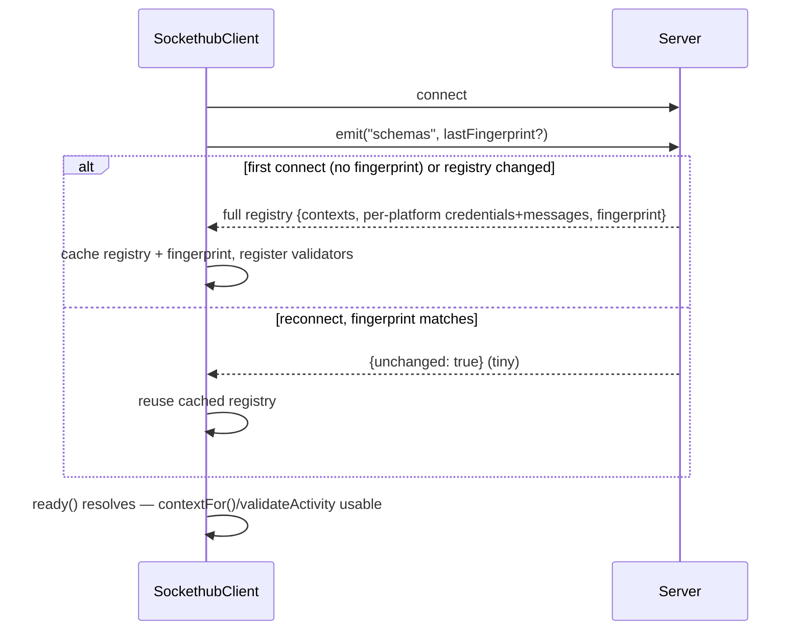
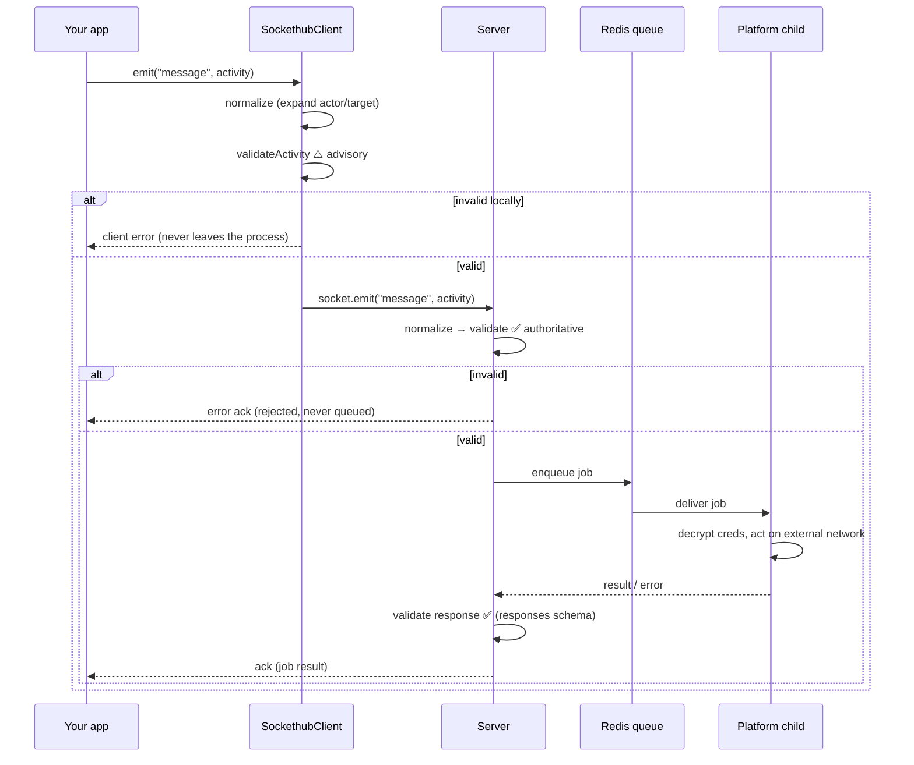
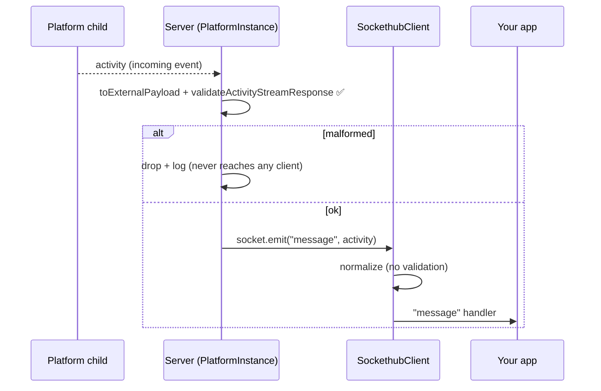
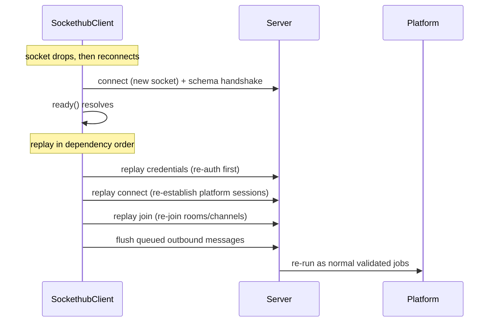

# Sockethub Architecture

A 30,000-foot view of how Sockethub translates web applications to internet protocols.

## System Overview

Sockethub is a protocol gateway that runs as four coordinated components:

```
┌─────────────────┐    ┌─────────────────┐    ┌─────────────────┐
│   Web Client    │    │   Web Client    │    │   Web Client    │
│  (Browser App)  │    │  (Browser App)  │    │  (Browser App)  │
└─────────┬───────┘    └─────────┬───────┘    └─────────┬───────┘
          │                      │                      │
          └──────────────────────┼──────────────────────┘
                                 │ WebSocket (Socket.IO)
                                 │
                    ┌────────────▼────────────┐
                    │   Sockethub Server      │
                    │ • Session Management    │
                    │ • Validation Pipeline   │
                    │ • Message Encryption    │
                    │ • Process Coordination  │
                    └────────────┬────────────┘
                                 │ Encrypted Job Queue
                                 │
                    ┌────────────▼────────────┐
                    │       Redis             │
                    │ • Encrypted Job Queue   │
                    │ • Encrypted Credentials │
                    │ • Session Isolation     │
                    └────────────┬────────────┘
                                 │ Encrypted Jobs
                                 │
        ┌────────────────────────┼────────────────────────┐
        │                        │                        │
┌───────▼────────┐     ┌──────────▼──────────┐    ┌────────▼────────┐
│ Platform       │     │  Platform           │    │ Platform        │
│ Worker (IRC)   │     │  Worker (XMPP)      │    │ Worker (Feeds)  │
│ • Child Process│     │  • Child Process    │    │ • Child Process │
│ • Protocol Impl│     │  • Protocol Impl    │    │ • Protocol Impl │
└────────────────┘     └─────────────────────┘    └─────────────────┘
```

**Data Flow**: Credentials and job payloads are encrypted at rest in Redis and on the
server↔platform job queue. The browser↔server hop is plain Socket.IO — run it over HTTPS/WSS
for transport encryption. Each phase handles specific responsibilities:

- **Web App**: Sends standardized ActivityStreams messages
- **Sockethub Server**: Validates, encrypts, and routes messages  
- **Redis Queue**: Stores encrypted jobs and credentials with session isolation
- **Platform Worker**: Decrypts jobs and translates to external protocols

## Component Responsibilities

It helps to be precise about which component is responsible for what — especially
around validation, which is a common point of confusion.

| Concern | Client (`@sockethub/client`) | Server (`@sockethub/server`) | Platform (child process) |
|---|---|---|---|
| Authoritative validation | ❌ | ✅ **both directions** | ❌ (trusts server) |
| Inbound validation (app → platform) | ⚠️ advisory pre-check | ✅ authoritative | — |
| Outbound validation (platform → app) | ❌ (normalizes only) | ✅ authoritative | — |
| Normalization (expand `actor`/`target` refs) | ✅ | ✅ inbound | — |
| Holds the schemas | copy pushed from server | source of truth | — |
| `@context` composition | ✅ `contextFor()` | — | — |
| Outbound queue until ready | ✅ | — | — |
| Reconnect replay (creds/connect/join) | ✅ | — | — |
| Process isolation / spawning | — | ✅ `ProcessManager` | runs platform code |
| Talks to external networks | — | — | ✅ |
| Encrypted credential storage | — | ✅ writes (Redis) | ✅ reads (decrypts) |

The client is an **ergonomic SDK, not a trust boundary**. Anything it does for
safety, the server also does — authoritatively. You could bypass the SDK and
emit raw Socket.IO events; the server would still validate everything.

## Validation Model

> **Validation authority lives entirely on the server, in both directions.** The
> client *also* validates, but only what it is about to send, and only as a local
> fail-fast convenience. The server never relies on the client having validated
> anything.

Each platform defines **three** schema kinds, which map to message directions:

| Schema | Describes | Server uses it | Pushed to client | Client uses it |
|---|---|---|---|---|
| `credentials` | app→server (set creds) | ✅ inbound (auth) | ✅ yes | ⚠️ advisory |
| `messages` | app→server (commands) | ✅ inbound (auth) | ✅ yes | ⚠️ advisory + `contextFor` |
| `responses` | platform→app (replies) | ✅ outbound (auth) | ❌ no | — |

This is why the server publishes schemas yet validation remains a server
responsibility: it publishes **only the two inbound schemas** (`credentials` +
`messages`) — exactly what the client needs to (a) sanity-check what *it* is
about to send and (b) build `@context` arrays. The `responses` schema stays
**server-side only**, because validating platform replies is the server's job;
the client simply trusts (and normalizes) what arrives.

Both the client pre-check and the server's inbound check run the **same schema
rules** — the client just received a copy of those rules over the wire during the
schema handshake.

## Client ⇄ Server Coordination

### Connect & schema handshake

On connect (and every reconnect) the client fetches the platform schema registry,
then caches it along with a server-supplied fingerprint. On a later request it
echoes the fingerprint so the server can skip re-sending an unchanged registry.



Until `ready()` resolves, outbound events from your app are **queued in memory**
and flushed automatically once the registry is applied.

### Sending a command (outbound)



The client check and the server check enforce the **same** `messages` rules; the
client one just saves a round-trip when the activity is obviously malformed.

### Receiving an event (inbound)

Incoming events flow from the platform outward to every client session attached
to that platform instance. The client validates what it **sends** but not what it
**receives**, because the server already validated the outbound side.



## Reconnection & Replay

Networks drop. The client makes reconnection transparent by remembering the
*state-establishing* activities you sent and replaying them — in dependency
order — once the new connection is ready. This is one of the main reasons to use
the SDK rather than a raw socket.

### What the client remembers

The client keeps three in-memory maps, updated as you emit:

| Map | Filled by | Cleared by |
|---|---|---|
| `credentials` | `credentials` activity (by actor id) | newer `credentials`; `clearCredentials()` |
| `connect` | a `connect` message | a `disconnect` message |
| `join` | a `join` message | a `leave` message |

`leave`/`disconnect` are treated as the inverse of `join`/`connect`, so the
remembered set always reflects your *current intended* state, not raw history.

### What happens on reconnect



Replay order matters — **credentials → connect → join → queued messages** — so
the platform is authenticated before it's asked to connect, and connected before
it's asked to join a room.

### Important properties

- **In memory only.** Nothing is persisted to localStorage, cookies, IndexedDB,
  or disk. State survives a brief network blip but is cleared on page refresh /
  tab close, and is not shared between tabs.
- **The server still validates replays.** Replayed credentials may have expired
  or been revoked; the server re-validates each replayed activity like any other
  inbound message, and persistent-platform session sharing is re-checked.
- **Opt out** by calling `sc.clearCredentials()` (e.g. on `disconnect`) if you
  don't want automatic credential replay.

See the [Client Guide](client-guide.md) for the app-facing API.

## Core Architectural Decisions

### Process Isolation

Think of Sockethub as a manager supervising multiple specialized workers, where each worker
is completely independent:

**Each Platform = Separate Process**: Every protocol (IRC, XMPP, Feeds) runs as its own child
process spawned by the main server. If the IRC platform crashes while processing a message, it
doesn't affect XMPP or the main server.

**Per-Login Isolation for Persistent Platforms**: For platforms that maintain connections (like
IRC or XMPP), each user login gets its own dedicated process. So if Alice connects to IRC as
"alice" and Bob connects as "bob", they each get separate IRC processes. This means:

- Alice's IRC connection problems don't affect Bob's
- Memory leaks from one user's connection are contained
- Each user's IRC session can be managed independently

**Why This Matters**: In traditional architectures, one bad connection or memory leak can bring
down the entire service. Sockethub's isolation means problems are contained to individual users
and platforms.

### Session Isolation

Every client WebSocket connection gets its own completely isolated environment:

- **Unique Session ID**: Generated per connection for complete isolation
- **Dedicated Encryption**: 32-character secret key per session
- **Redis Namespace**: keys scoped per session (parent + session id) prevent cross-session access
- **Automatic Cleanup**: All session data cleared on disconnect

### Job Queue Coordination

Redis and BullMQ provide reliable, encrypted communication between server and platforms:

- **Async Processing**: Server doesn't block waiting for platform responses
- **Message Encryption**: All job data encrypted before queuing
- **Reliable Delivery**: Jobs persist across restarts and failures
- **Platform Routing**: Each platform has dedicated queues per session

## Message Flow

### Client to Platform

```
1. Client sends ActivityStreams message via WebSocket
2. Server validates message through middleware pipeline
3. Server encrypts message and adds to platform's job queue
4. Platform worker receives encrypted job from queue
5. Platform worker decrypts job and calls appropriate method
6. Platform translates to external protocol (IRC, XMPP, HTTP, etc.)
7. Platform sends response back through queue to client
```

### Platform to Client

```
1. External service sends data to platform (incoming IRC message, etc.)
2. Platform converts to ActivityStreams format
3. Platform sends message directly to server via IPC
4. Server routes message to appropriate WebSocket client(s)
```

### Example Flow (IRC Message)

```javascript
// 1. Client sends ActivityStreams
{
  "type": "send",
  "@context": [
    "https://www.w3.org/ns/activitystreams",
    "https://sockethub.org/ns/context/v1.jsonld",
    "https://sockethub.org/ns/context/platform/irc/v1.jsonld"
  ],
  "actor": { "id": "mynick@irc.libera.chat", "type": "person", "name": "mynick" },
  "target": { "id": "javascript@irc.libera.chat", "type": "room", "name": "#javascript" },
  "object": { "type": "message", "content": "Hello!" }
}

// 2. Server queues encrypted job for IRC platform
// 3. IRC platform worker receives job
// 4. IRC platform sends: "PRIVMSG #javascript :Hello!"
// 5. IRC platform reports success back to client
```

## Security Model

### Encryption Everywhere

- **Session Keys**: Unique 32-character encryption key per client session
- **Encrypted at rest**: credentials and job payloads are encrypted before being stored in Redis
- **Encrypted on the queue**: job messages are encrypted between the server and platform workers
- **Transport**: the browser↔server Socket.IO hop is not app-encrypted — serve over HTTPS/WSS

### Multi-Level Isolation

- **Process Level**: Platforms run in separate memory spaces
- **Session Level**: Each client session has isolated Redis namespace
- **Network Level**: Platforms can be sandboxed or run on separate machines
- **Credential Scoping**: Each platform only accesses its own credentials per session

### Validation Pipeline

The per-session middleware chain runs on each inbound event; the validated job is
then handed to the job-queue layer, which encrypts the payload as it enqueues:

```
middleware:  normalize → schema validation → credential handling
job queue:   queue.add() → encrypt payload → enqueue (Redis/BullMQ)
```

Encryption is not a middleware step — it happens inside `@sockethub/data-layer`
(`JobQueue.createJob` → `encryptActivityStream`) when `platformInstance.queue.add()`
is called; the worker decrypts via `decryptJobData` before running the platform
handler.

## Platform Types

Platforms are configured to operate in two different modes based on their protocol requirements:

### Stateless Platforms

These don't maintain persistent connections and start fresh for each job. Good for protocols
like RSS feeds or HTTP APIs where you just fetch data when needed.

### Persistent Platforms  

These maintain long-running connections and require authentication. Examples include IRC (which
requires login and maintains a connection to send/receive real-time messages) or XMPP (which
keeps a connection open for instant messaging).

The platform configuration determines which mode a platform operates in, affecting how many
processes are spawned and how credentials are handled.

## Scalability Characteristics

### Horizontal Scaling

- **Multiple Server Instances**: Load balance WebSocket connections across servers
- **Redis Clustering**: Distribute job queue and credential storage
- **Platform Distribution**: Run platform workers on dedicated machines
- **Geographic Distribution**: Platforms can be closer to target services

### Resource Management

- **Connection Pooling**: Platforms reuse connections where possible
- **Process Lifecycle**: Platform processes automatically cleaned up on session end
- **Memory Limits**: Platform crashes contained to individual processes
- **Job Persistence**: Work survives server restarts

## ActivityStreams Translation

The core value of Sockethub is translating between web-friendly ActivityStreams and traditional
internet protocols:

### Incoming Translation

```
IRC: ":alice!user@host PRIVMSG #room :hello world"
  ↓
ActivityStreams: {
  "type": "send",
  "@context": ["...as2", "...sockethub", "...irc"],
  "actor": { "id": "alice@irc.libera.chat", "type": "person", "name": "alice" },
  "target": { "id": "room@irc.libera.chat", "type": "room", "name": "#room" },
  "object": { "type": "message", "content": "hello world" }
}
```

### Outgoing Translation  

```
ActivityStreams: {
  "type": "join",
  "@context": ["...as2", "...sockethub", "...irc"],
  "actor": { "id": "mynick@irc.libera.chat", "type": "person", "name": "mynick" },
  "target": { "id": "room@irc.libera.chat", "type": "room", "name": "#room" }
}
  ↓
IRC: "JOIN #room"
```

### Unified Interface

Web applications send the same ActivityStreams format regardless of target protocol:

```javascript
// Same message format works for IRC, XMPP, or any messaging platform
// Only the @context array changes to select the platform
{
  "type": "send",
  "@context": [
    "https://www.w3.org/ns/activitystreams",
    "https://sockethub.org/ns/context/v1.jsonld",
    "https://sockethub.org/ns/context/platform/irc/v1.jsonld"
  ],
  "actor": { "id": "user@irc.libera.chat", "type": "person", "name": "user" },
  "target": { "id": "room@irc.libera.chat", "type": "room", "name": "#room" },
  "object": { "type": "message", "content": "Hello!" }
}
```

## Extension Points

### Custom Platforms

Create new platforms by implementing the standard interface and packaging as npm modules
following the `@sockethub/platform-*` naming convention. Add to the platform configuration
array to enable.

### Middleware Pipeline

Extend server functionality through middleware for custom validation, message transformation,
authentication integration, or monitoring.

This architecture provides a robust, secure, and scalable foundation for bridging web
applications with any internet protocol while maintaining strong isolation and reliability
guarantees.
